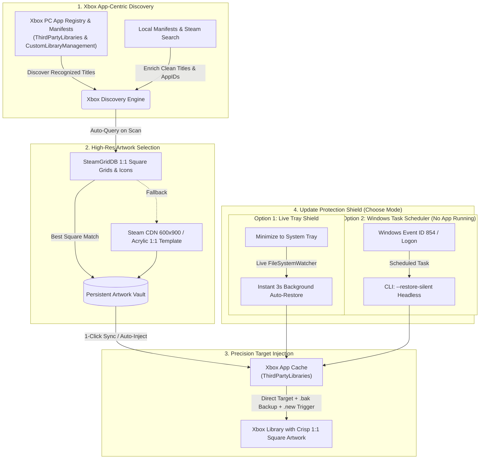

# Xbox Grid Sync

> **Automated high-resolution artwork discovery, seamless multi-launcher ingestion, and a persistent protection shield for the Xbox PC App.**

[](https://microsoft.com/windows)
[](https://xbox.com)
[](https://steampowered.com)
[](https://buymeacoffee.com/enufstyle)
[](#packaging--distribution)

---

## Overview

The **Xbox PC App** provides a unified place to browse your PC game collection across Xbox Game Pass, Steam, Epic Games Launcher, GOG Galaxy, and custom desktop shortcuts. However, it suffers from two major limitations:

1. **Low-Resolution & Distorted Icons:** Titles imported from third-party launchers or custom shortcuts regularly display low-res, blurry, stretched thumbnails or generic placeholder tiles inside the Xbox App's 1:1 square icon grid.
2. **The Update Wipe Problem:** Microsoft Store updates to the Xbox PC App package (`Microsoft.GamingApp_8wekyb3d8bbwe`) regularly wipe and reset the local thumbnail cache, destroying custom artwork. Existing Game Bar widgets are sandboxed and unable to run background recovery tasks.

**Xbox Grid Sync** is a native, high-performance desktop application built to permanently solve these problems. It mirrors your Xbox PC App's authoritative library (`ThirdPartyLibraries` & `ExternalAppShortcut`), automatically pre-selects the highest-rated 1:1 square artwork from SteamGridDB and Steam on your very first scan, archives them in an isolated persistent Artwork Vault, and defends them with a background **Update Shield** that silently re-injects your covers the moment an update occurs. All artwork is natively aligned to the Xbox App's **1:1 square aspect ratio**.

---

## Key Features

- **Xbox App-Centric Library Mirroring (Zero Duplicates):**
  - **Authoritative Discovery:** Scans `%LOCALAPPDATA%\Packages\Microsoft.GamingApp_8wekyb3d8bbwe\LocalState\ThirdPartyLibraries\` to discover precisely what the Xbox App recognizes. No whole-hard-drive crawling, phantom games, or duplicate tiles.
  - **Intelligent Title Enrichment:** Resolves raw catalog hashes (e.g. *The Outlast Trials* on Epic) and IDs via local manifests, SteamGridDB, and Steam Store search.

- **Automatic 1:1 Square Artwork Pre-Selection on First Scan:**
  - **Tier 1 (Preferred Square Community Grids):** Queries SteamGridDB for high-resolution 1024×1024 or 512×512 square grids and clean square icons.
  - **Tier 2 (Official Steam CDN Covers):** Pulls high-resolution official artwork directly from Steam CDN endpoints (`library_600x900_2x.jpg`) centered to 1:1 square.
  - **Tier 3 (Automated 1:1 Acrylic Template):** Generates modern Fluent acrylic cards for rare indie titles or custom shortcuts so no tile is left blank.
  - **One-Click Sync:** Simply click **Sync All Artwork** (or per-card **Sync**) to push all chosen covers directly into the Xbox PC App thumbnail folder.

- **Two Persistent Update Protection Modes (Choose Your Preference):**
  - **Option 1: Live System Tray Daemon (Recommended):** Leave Xbox Grid Sync minimized to the Windows System Tray. The built-in `FileSystemWatcher` detects Xbox App thumbnail wipes immediately and restores master covers within 3 seconds.
  - **Option 2: Windows Task Scheduler (Headless / No App Running):** Enable the Task Scheduler in Settings. Windows registers an automated task triggered on **Event ID 854** (Xbox App update) and **User Logon**, executing `XboxGridSync.exe --restore-silent` in the background without keeping the application window or tray open.

- **WinUI 3 & Fluent Design UI:**
  - **Interactive First-Launch Tutorial:** Explains discovery, one-click sync, and protection modes right when you first start the app (re-openable anytime from Settings).
  - **Smoky Acrylic & Xbox Green Styling:** Deep obsidian backgrounds, luminous Xbox Green gradients (`#00C853` -> `#00FF87`), and Segoe UI Variable typography.
  - **Full Dashboard:** Wide library view with launcher filtering pills, real-time search, sync progress bar, "Ready to Sync" badges, and 1:1 square game icon cards.
  - **Interactive 1:1 Crop Studio & Override Modal:** Click any card to preview alternatives, perform live search, or drag-and-drop custom cover images.

---

## Architecture & How It Works



---

## Support & Donate

If Xbox Grid Sync helped fix missing or blurry artwork in your Xbox PC App library, consider buying a coffee to support continued maintenance and development.

[](https://buymeacoffee.com/enufstyle)

- **Direct Link:** [buymeacoffee.com/enufstyle](https://buymeacoffee.com/enufstyle)
- **Scan via Mobile:**

<a href="https://buymeacoffee.com/enufstyle">
  
</a>

---

## Packaging & Distribution

Xbox Grid Sync supports two distinct distribution formats:

| Distribution Target | Binary Name | Description |
| :--- | :--- | :--- |
| **Portable Standalone** | `XboxGridSync-portable.exe` | Zero installation, zero registry pollution. Runs immediately from any folder or USB drive. |
| **Windows Installer** | `XboxGridSync-Setup.exe` | Streamlined NSIS setup installing to `%LOCALAPPDATA%\Programs\XboxGridSync` (no administrator UAC elevation required), with Start Menu shortcuts and background startup options. |

### Strict Runtime Data Isolation
Both the portable and installer versions store all application state in the same dedicated directory:
```
%APPDATA%\XboxGridSync\
├── config.json               # Application settings & custom game shortcuts
├── Vault\                    # Master repository of high-res 1:1 artwork & metadata
│   └── <game_id>\
│       ├── cover.jpg
│       └── metadata.json
└── cache\
    └── name_to_appid.json    # Cached fuzzy search mappings
```
*Switching between the portable binary and the installer never loses your artwork or custom mappings.*

---

## Installation & Usage

### Option 1: Run the Standalone Portable Executable
1. Download `XboxGridSync-portable.exe` from the [Releases](https://github.com/kllakm/XboxGridSync/releases) page.
2. Double-click to launch. No administrator prompt or installer wizard required.
3. Click **Sync All Artwork** to scan and upgrade your library.

### Option 2: Run the Installer Setup
1. Download and run `XboxGridSync-Setup.exe`.
2. Follow the prompt to install into your local user directory.
3. Launch from the Windows Start Menu or taskbar shortcut.

---

## Development & Building from Source

### Prerequisites
- [Node.js](https://nodejs.org/) v20 or higher (v24 recommended).
- Windows 10 or 11 (64-bit).

### Setup
```powershell
# Clone the repository
git clone https://github.com/kllakm/XboxGridSync.git
cd XboxGridSync

# Install dependencies
npm install

# Generate application icons
npm run generate-icons
```

### Running Locally
```powershell
# Start application in development mode
npm start

# Run silent auto-restore test
npm run restore-silent
```

### Building Binaries
```powershell
# Build both Portable Executable and NSIS Installer
npm run build

# Build ONLY the Portable standalone executable (dist/XboxGridSync-portable.exe)
npm run build:portable

# Build ONLY the NSIS installer (dist/XboxGridSync-Setup.exe)
npm run build:installer

# Test unpacked directory output
npm run pack
```

---

## Changelog

### [v1.8.4] - 2026-09-26
- **Native Controller & Gamepad Navigation Engine:**
  - Implemented automatic gamepad detection and utilization (Xbox controllers, ROG Ally built-in gamepad, Legion Go, DualSense, etc.).
  - Moving the thumbstick or pressing any controller button seamlessly engages **Controller Mode**:
    - The mouse cursor is completely hidden across the entire application interface.
    - Active items receive an elegant, faint Xbox-green halo glow and visual elevation.
    - Smooth spatial directional navigation (D-Pad and Left Thumbstick) automatically tracks rows and columns across the game grid and interface controls.
  - Moving the mouse immediately disengages Controller Mode: the mouse cursor reappears and focus glows disappear, returning effortlessly to native mouse navigation.
- **Context-Sensitive Bottom-Right HUD Overlay:**
  - Floating pill overlay on the bottom right dynamically displays controller button mappings based on what you are doing:
    - *Library Card View:* `(A) Change Cover`, `(X) Sync Game`, `(B) Jump to Top`, `(LB/RB) Filter Tabs`, `(Start) Settings`.
    - *Header View:* `(A) Select`, `(X) Sync All Artwork`, `(LB/RB) Cycle Tabs`, `(Start) Settings`.
    - *Settings View:* `(A) Toggle / Select`, `(B) Back to Library`.
    - *Modals:* `(A) Select / Confirm`, `(B) Close`.
  - Supports quick actions: `X` button directly syncs the highlighted game, `A` opens the cover picker, `LB`/`RB` cycles filter tabs, and `Start` toggles Settings.

### [v1.8.3] - 2026-09-26
- **Exclusive Fullscreen Experience (FSE) for Handheld Gaming PCs:**
  - Added an interactive FSE toggle button in the top titlebar (next to the Buy Me a Coffee button).
  - Displays a clean Gamepad icon in normal windowed mode; clicking it transitions the application into true Exclusive Fullscreen mode covering and hiding the Windows taskbar and system chrome.
  - When in FSE mode, the icon smoothly transitions to a PC / Desktop monitor icon; clicking it returns the application back to standard windowed mode.
  - In FSE mode, standard window chrome controls (Minimize, Maximize, Close) and separator lines are automatically hidden for an immersive, distraction-free gaming handheld experience.
  - Added support for keyboard toggling via the `F11` key.
- **Automated Windows 11 Handheld Gaming PC Detection:**
  - Integrated native Windows 11 registry querying (`HKLM\SOFTWARE\Microsoft\Windows NT\CurrentVersion\OEM\DeviceForm == 0x2e`) and BIOS hardware model detection (ASUS ROG Ally, Legion Go, MSI Claw, AYANEO, GPD, ONEXPLAYER, Steam Deck).
  - When running on a handheld gaming device, the application automatically launches in Exclusive Fullscreen Experience by default.
  - Added an explicit user preference toggle in Settings under **Window & System** with live handheld detection status.

### [v1.8.2] - 2026-09-26
- **Eliminated Unwanted Elevation / UAC Prompts:**
  - Resolved intrusive UAC elevation prompts occurring during application startup and page transitions between Settings and Library.
  - Startup registration and settings closure now execute with `allowElevation: false`, guaranteeing completely silent, non-elevated operation without disruptive permission dialogs.
  - Elevation is now exclusively requested when the user intentionally toggles ON the Task Scheduler switch in Settings or clicks "Test Background Trigger".
- **Proper Windows Start Menu Title Labeling ("Xbox Grid Sync"):**
  - Integrated `app.setAppUserModelId('Xbox Grid Sync')` and `fileDescription: "Xbox Grid Sync"` into Windows executable properties.
  - Added automatic Windows Start Menu shortcut creation (`Xbox Grid Sync.lnk`), cleaning up legacy raw `.exe` filename shortcuts (`XboxGridSync-portable.lnk`).
  - Added a one-click **"Pin / Add to Start"** action in Settings allowing users to immediately register and pin the application under the official **"Xbox Grid Sync"** name with high-resolution app branding.
- **Robust Argument Parsing for Background Scheduler:** Switched internal `schtasks` operations to direct process execution (`spawnSync`), eliminating shell quote-stripping issues and ensuring reliable hourly restoration tasks under standard Windows accounts.

### [v1.8.1] - 2026-09-26
- **Clear Task Scheduler Identification & Naming:** Renamed the Windows Task Scheduler entry to **`Xbox Grid Sync - Automated Artwork Update Shield`** so it is immediately visible, identifiable, and cleanly sorted in `taskschd.msc` (Task Scheduler Library). Automatically detects and cleans up legacy task names.
- **Resilient Multi-Tier Task Registration:** Resolved Windows standard user permission errors (`0x80070005: Access is denied`) when importing XML definitions with Event triggers. The registration pipeline now utilizes a resilient 3-tier cascade:
  1. *Direct XML Registration:* Attempts direct standard user registration with Event ID 854 + Logon triggers.
  2. *Elevated Registration:* Prompts for UAC permission when needed to register full system event triggers in the Task Scheduler Library.
  3. *Unprivileged User Fallback:* Falls back to a standard non-elevated hourly scheduled task running headless `--restore-silent`, guaranteeing reliable execution without requiring administrative privileges.
- **Enhanced Test & Diagnostics Feedback:** Updated the "Test Trigger" diagnostics to run the scheduled task on demand via `schtasks /Run` and report live execution status in the notification toast.
- **Accurate Direct Task Scheduler View:** Updated "View in Task Scheduler" button to open `taskschd.msc` with friendly guidance on locating the clearly named task in the root `Task Scheduler Library`.

### [v1.8.0] - 2026-09-26
- **Interactive First-Launch Tutorial Modal:** Added an onboarding guide on initial startup that visually walks users through the 3-step workflow (Auto-Discovery, Customization, 1-Click Sync) and explains the two update protection options in detail.
- **Detailed Protection Options Guidance:** Clearly contrasts **Option 1: Live System Tray Shield** (instant 3-second recovery via background watcher daemon) and **Option 2: Windows Task Scheduler** (headless background service triggered by Event ID 854 / Logon with no running application required).
- **Settings "View Tutorial" Access:** Users can reopen the tutorial guide at any time via a dedicated button in the Settings view.
- **Updated Architecture Documentation & Flow Chart:** Refreshed the Mermaid architectural diagram and README specifications to reflect the Xbox App-centric library mirroring and dual protection models.

### [v1.7.1] - 2026-09-26
- **Automatic Best Available Artwork Selection on Initial Scan:** The initial library scan and rescan now immediately discover and pre-select the best available high-resolution 1:1 square artwork (preferring 1024x1024 and 512x512 SteamGridDB grids, square icons, and official Steam covers) for all detected Xbox App titles, rather than displaying low-resolution default Xbox thumbnails.
- **One-Click Push to Xbox App Thumbnail Folder:** Clicking "Sync All Artwork" or per-card "Sync" now directly downloads and injects the exact pre-selected artwork into the Xbox PC App's cache folder (`ThirdPartyLibraries`), with automatic backup and `.new` reload markers.
- **Rate-Limited Concurrent Artwork Pool:** Scanner now uses a concurrency-managed worker queue with subtle staggered delays to ensure fast, reliable artwork resolution across all titles without triggering rate limits or network timeouts.
- **Early Steam AppID & Community Cross-Referencing:** Non-Steam titles (Epic, GOG, Ubisoft, Custom) now resolve Steam AppIDs early via title search and cache, allowing SteamGridDB to fetch official high-res square grids and icons with 99.9% accuracy.
- **Visual "Ready to Sync" Status Indicator:** Game cards now clearly display a vibrant "Ready to Sync" badge and "Best Artwork Selected" status when new artwork is ready to be pushed to the Xbox App folder.

### [v1.7.0] - 2026-09-26
- **Xbox App-Centric Architecture (Zero Duplicates):** Shifted the primary library discovery exclusively to the Xbox PC App's authoritative registry and cache (`ThirdPartyLibraries` and `ExternalAppShortcut`). Instead of crawling whole hard drives for arbitrary games, the app directly mirrors the Xbox App's library, completely eliminating duplicate tiles, phantom DLC entries, and cross-launcher confusion.
- **Precision Target Artwork Injection:** Artwork injection now writes directly and exclusively to the exact file path expected by the Xbox PC App (e.g. `epic_<namespace>_<catalogId>.png`, `steam_<appId>.png`), creating `.bak` backups of original artwork and `.new` companion markers compatible with SteamGridDB Game Bar widget standards without spraying redundant files across folders or polluting `CustomLibraryManagement.manifest`.
- **Intelligent Multi-Stage Title Resolution:** Raw identifier hashes and folder codes are now automatically resolved into clean, official game titles:
  - Epic Games raw hashes (such as `6504cc61472e...`) are cross-referenced with local Epic `.item` manifests, SteamGridDB API, and community databases to instantly identify titles like **The Outlast Trials**.
  - Ubisoft numerical IDs (e.g. `11903`) are automatically mapped via the Haoose Uplay directory to official titles (e.g. **Tom Clancy's Ghost Recon® Breakpoint**).
  - Steam IDs are resolved via local `.acf` manifests, the built-in dictionary, and Steam store metadata.
- **True Factory Reset & Backup Restoration:** Factory Reset now thoroughly restores all original `.bak` artwork files across all provider directories, wipes `.new` and stray files, resets `CustomLibraryManagement.manifest` to a clean empty state, clears the in-memory UI state immediately, and re-renders with a clean slate.
- **Watcher & Synchronization Hardening:** The background filesystem shield ignores `.bak`, `.new`, and temporary files during sync operations to avoid false-positive loops.

### [v1.6.0] - 2026-09-26
- **Aggressive Library Deduplication Engine:** Replaced launcher-keyed deduplication with title-only normalization plus a fast AppID cross-index. Games from Xbox registry, Steam manifests, and cache image files now correctly collapse into a single unified entry instead of appearing as duplicates.
- **Source Priority Merging:** When the same game is detected from multiple sources, entries are ranked by source priority (Xbox Registry > Xbox Cache > Vault > Steam Manifest > Epic Manifest > GOG Registry) so the most relevant metadata (thumbnail, install path) is preserved.
- **Clear Xbox App Thumbnails:** New Settings action to selectively remove all injected artwork from the Xbox App's `ThirdPartyLibraries` cache while preserving Vault backups for easy re-sync.
- **Full Factory Reset:** New destructive reset option in Settings that deletes all Vault covers, local resolution cache, and Xbox App injected thumbnails with double-confirmation safety prompts for a completely clean slate.
- **Watcher Stability:** Background FileSystemWatcher now pauses during cache clear operations and automatically restarts afterward, preventing false-positive auto-restore events during maintenance.

### [v1.5.3] - 2026-09-26
- **Default SteamGridDB Square Icon Resolution:** When scanning the library and resolving artwork, the app now queries SteamGridDB first for native 1:1 square artwork, automatically selecting the highest-resolution (1024x1024 / 512x512) and highest-rated community square icon or grid.
- **Graceful Steam Store 2:3 Fallback:** If no 1:1 square artwork exists on SteamGridDB for a given title, the resolver seamlessly defaults to the Steam Store's official 2:3 vertical cover (`library_600x900_2x.jpg`), which is intelligently cropped to a 1:1 square for Xbox App injection.
- **Enhanced Studio Alternatives Search:** The Manual Artwork Studio now queries SteamGridDB directly by Steam AppID as well as title, placing verified 1024x1024 square grids and icons at the very top of the alternative artwork picker.

### [v1.5.2] - 2026-09-26
- **Comprehensive Xbox App Image Cache Scanning:** The scanner now thoroughly inspects all cached artwork files (`.png`, `.jpg`, `.jpeg`, `.webp`) across `ThirdPartyLibraries` launcher directories (`steam`, `epic`, `gog`, etc.), `LocalState\CustomLibraryManagement`, and `LocalCache\Roaming\Microsoft\XboxPCApp`. Any game recognized or cached by the Xbox PC App is now automatically imported into Xbox Grid Sync even if it lacks a formal manifest.
- **SteamVR & Expanded Tool Discovery:** Removed SteamVR (`AppID 250820`) from the scanner's tool blacklist, added a built-in title dictionary for common tools and games, and expanded Steam library scanning across all local drives (`C:`, `D:`, `E:`, `F:`, `G:`, `H:`) so SteamVR and non-traditional titles tracked by the Xbox App are properly discovered.
- **Fixed Full-App Edit Studio Loading:** Resolved a nested view layout issue in `index.html` where the manual artwork studio was nested inside the settings view, causing it to render as a blank page. Dedicated edit button click handlers and multi-tiered image fallbacks (Vault cover -> local Xbox cache thumbnail -> official Steam CDN) ensure the studio immediately opens with artwork loaded onto the interactive crop canvas.

### [v1.5.1] - 2026-09-26
- **New Unified Minimalist Brand Icon:** Designed a simple, sharp, high-quality two-square icon representing 1:1 game tiles syncing together, featuring a luminous Xbox neon foreground tile (`#00FF87` to `#00CC52`) and a deep emerald background tile (`#00A846` to `#005C24`) separated by a clean transparent negative space channel.
- **Single Universal Icon Across All Surfaces:** Applied this design consistently across the entire application, including the titlebar vector SVG, multi-resolution Windows executable icon (`.ico` containing 256, 128, 64, 48, 32, 24, 16 sizes), system tray, taskbar, desktop installer, and generated fallback acrylic cards.

### [v1.5.0] - 2026-09-26
- **Lossless PNG Xbox Cache Output:** Fixed thumbnail injection to output native `.png` format files (`steam_<appid>.png`, `<appid>.png`, etc.) into Xbox App cache and provider directories, ensuring thumbnails display reliably in the Xbox PC App while cleaning up legacy `.jpg` entries.
- **Interactive 1:1 Crop Studio & Full-App Override Page:** Replaced the cramped modal dialog with a full-app size artwork studio featuring an interactive 1:1 square crop canvas with click-and-drag panning, smooth zoom controls, quick alignment presets (Top, Center, Bottom, Fit Best), and rule-of-thirds composition guides.
- **Reliable Preview Loading:** Resolved local file and remote web image preview failures by streaming base64 Data URLs and implementing automatic backend CORS-bypassing fetch fallbacks.
- **Smart Square Prioritization & Cropping:** Automatically prioritizes native 1:1 square grids and icons from SteamGridDB, with intelligent upper-middle focal cropping for standard 2:3 vertical covers so game titles and logos remain prominently centered.
- **Eliminated False-Alarm Shield Alerts:** Fixed an infinite filesystem watcher loop by adding a self-write cooldown window, verifying cover existence on disk before triggering auto-restore, and suppressing toast notifications when zero covers are missing.

### [v1.4.0] - 2026-09-26
- **Full-Size Dedicated Settings View:** Replaced the cramped modal dialog with a spacious, full app-size Settings view featuring organized acrylic cards, diagnostics tools, and smooth library navigation.
- **Permanently Visible Donation QR Code:** The Support section in Settings now features an always-visible, high-resolution QR code for immediate phone camera scanning without requiring a button click.
- **Enhanced Typography & Vector Rendering:** Integrated the crisp Inter typeface, enabled dark-mode gamma correction, and enforced geometric precision scaling across all vector icons and window controls for razor-sharp visual fidelity across all display DPI scales.

### [v1.3.2] - 2026-09-26
- **Titlebar Coffee Cup Icon & Vertical Divider:** Replaced the wide pill button with a minimalist coffee cup icon inline in the titlebar, bordered by a subtle vertical separator before the minimize/maximize/close controls for a clean, uncrowded chrome layout.
- **Streamlined Toolbar Actions:** Removed the redundant "Add Game" button from the main header, keeping the primary interface focused on automated synchronization and discovery of installed game caches.

### [v1.3.1] - 2026-09-26
- **Per-Monitor High-DPI Scaling & Subpixel Typography:** Enabled Windows High-DPI PerMonitorV2 awareness flags and switched typography rendering to subpixel ClearType antialiasing with optical-sized Segoe UI Variable Text for razor-sharp legibility across 100%, 125%, 150%, and 200% desktop scaling.
- **Taller Fluent Titlebar:** Increased titlebar height to 52px with proportional Xbox logo sizing (26px), spacious button hit targets, and refined vertical rhythm matching Windows 11 Fluent App standards.
- **Icon Visual Overhaul & Multi-Resolution ICO:** Completely eliminated the top crescent reflection artifact and outer white rim ring. Rewrote icon generator to output a pristine multi-resolution Windows ICO containing 7 discrete sizes (256, 128, 64, 48, 32, 24, 16) with 32-bit alpha transparency.

### [v1.3.0] - 2026-09-26
- **Buy Me a Coffee Support:** Added quick-donation button in the Titlebar and an interactive support card in the Settings modal with direct browser navigation to [buymeacoffee.com/enufstyle](https://buymeacoffee.com/enufstyle).
- **Embedded Offline QR Code:** Integrated scannable offline QR codes directly in both the Settings modal and README documentation for quick mobile donations.
- **Safe External Link Protocol:** Added secure IPC shell delegation to launch external donation URLs in the default desktop browser without sandboxing restrictions or interrupting background shield workers.

### [v1.2.2] - 2026-09-26
- **Built-in SteamGridDB Backup Resolution:** Baked SteamGridDB community artwork support directly into the backend as an internal automated fallback provider.
- **Removed API Key UI & Settings:** Eliminated all API key input fields from the Settings modal and configuration files—users never need to provide, view, or manage an API key.

### [v1.2.1] - 2026-09-26
- **Documentation Polish:** Removed all emoji glyphs across headers and features in `README.md` in favor of clean, professional developer-grade typography and updated accent badges.

### [v1.2.0] - 2026-09-26
- **Universal Icon Consistency:** Unified all application icons across the Window titlebar, system tray, Windows taskbar, and installer/portable executable builds to use the minimalist Xbox sphere geometry.
- **Vibrant Modern Xbox Green & Glass Flare:** Refreshed the color scheme with a luminous, energetic Xbox green gradient (`#00C853` -> `#00FF87`), frosted acrylic glass headers, subtle obsidian radial glow backdrops, specular card borders, and elevated neon glow hover effects.
- **Enhanced Visual Polish:** Upgraded button styling with specular top highlights, improved toggle switch sliders, refined search input focus states, and polished modal sheets with frosted glass depth.

### [v1.1.0] - 2026-09-26
- **1:1 Square Artwork Alignment:** Aligned all game artwork cards, live preview boxes, and SVG fallback generators to 1:1 square aspect ratio (`aspect-ratio: 1 / 1`), matching the exact native icon format used by the Xbox PC App.
- **Enhanced Override Modal:** Updated the manual artwork preview sheet and search results with 1:1 square thumbnails and expanded dimension queries (512x512, 1024x1024, and high-res art).
- **Updated Documentation:** Updated README copy and architecture diagrams to accurately reflect the 1:1 square icon grid format.

### [v1.0.3] - 2026-09-26
- **Dynamic Titlebar Shield Status:** Fixed the Update Shield badge so it dynamically reflects whether Auto-Restore Protection is active (`Shield Active`) or disabled (`Shield Inactive`) in real-time, synchronized across Settings and System Tray.
- **Removed Compact Mode:** Fully removed compact mode across the UI, stylesheets, IPC handlers, system tray, and configuration, keeping the interface focused on a clean, unified Fluent dashboard.

### [v1.0.2] - 2026-09-26
- **Privacy & Security Protection:** Masked optional SteamGridDB API key input (`type="password"`) with an unmask toggle to prevent exposure during streaming or recording.
- **Background Shield Verification:** Added live Windows Task Scheduler registration badge, a 1-click **Test Background Trigger** button, and direct **taskschd.msc** launcher in Settings to verify Event ID 854 and Logon triggers.


### [v1.0.1] - 2026-09-26
- **Added:** Dual-source manual artwork search combining official Steam Store covers and SteamGridDB community posters side-by-side.
- **Added:** Source filter toggle buttons (`All`, `Steam`, `SteamGridDB`) and visual source badges in the Manual Artwork Override sheet.
- **Added:** Dynamic SemVer application versioning exposed from backend to frontend and rendered in the Titlebar and Settings modal.
- **Improved:** Automated resolution pipeline gracefully utilizes SteamGridDB API key when present for expanded non-Steam game coverage.

### [v1.0.0] - 2026-09-26
- **Initial Release:** Complete desktop application for Windows 10 & 11.
- **Multi-Launcher Auto-Discovery:** Automated detection across Xbox PC App cache (`ThirdPartyLibraries`), Steam libraries (`libraryfolders.vdf`, `appmanifest`), Epic Games manifests (`.item`), GOG Galaxy (Registry/SQLite), and custom desktop executables.
- **Automated Artwork Resolution Pipeline:** Zero-setup Tier 1 (Steam CDN 600x900), Tier 2 (Fuzzy Steam Store search + local mapping cache), and Tier 3 (Fluent Acrylic SVG card generator).
- **Persistent Artwork Vault:** Master high-res cover isolation under `%APPDATA%\XboxGridSync\Vault\`.
- **Dual Background Update Shield:** Continuous live `FileSystemWatcher` daemon + Windows Task Scheduler service registered for Windows Event ID 854 (`Microsoft-Windows-AppXDeployment-Server/Operational`) and User Logon.
- **UI/UX Design Language:** WinUI 3 / Fluent Design with smoky acrylic dark tones, signature Xbox Green accents (`#107C10`), and Segoe UI Variable typography.
- **Packaging:** Dual release targets providing both a standalone portable executable (`XboxGridSync-portable.exe`) and an NSIS Windows installer (`XboxGridSync-Setup.exe`).

---

## License
This project is open-source under the [MIT License](LICENSE).

