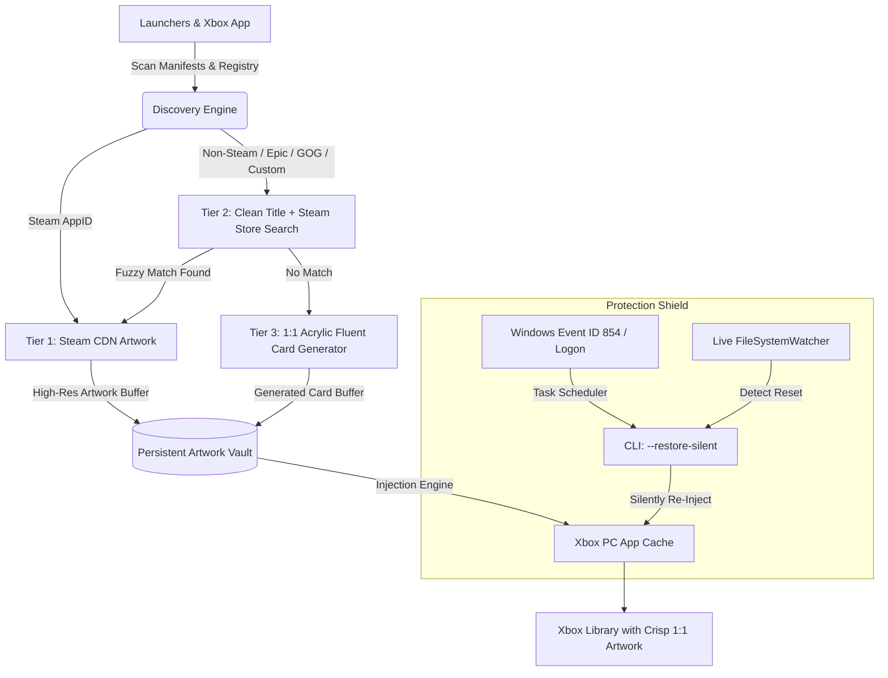

# Xbox Grid Sync

> **Automated high-resolution artwork discovery, seamless multi-launcher ingestion, and a persistent protection shield for the Xbox PC App.**

[](https://microsoft.com/windows)
[](https://xbox.com)
[](https://steampowered.com)
[](https://buymeacoffee.com/enufstyle)
[](#packaging--distribution)

---

## Overview

The **Xbox PC App** provides a unified place to browse your PC game collection across Xbox Game Pass, Steam, Epic Games Launcher, GOG Galaxy, and custom desktop shortcuts. However, it suffers from two major limitations:

1. **Low-Resolution & Distorted Icons:** Titles imported from third-party launchers or custom shortcuts regularly display low-res, blurry, stretched thumbnails or generic placeholder tiles inside the Xbox App's 1:1 square icon grid.
2. **The Update Wipe Problem:** Microsoft Store updates to the Xbox PC App package (`Microsoft.GamingApp_8wekyb3d8bbwe`) regularly wipe and reset the local thumbnail cache, destroying custom artwork. Existing Game Bar widgets are sandboxed and unable to run background recovery tasks.

**Xbox Grid Sync** is a native, high-performance desktop application built to permanently solve these problems. It automatically identifies games from all your launchers, retrieves high-resolution artwork directly from public Steam CDN endpoints without requiring any API keys, deposits them in an isolated persistent Artwork Vault, and defends them with a background **Update Shield** that silently re-injects your covers the moment an update occurs. All artwork is natively aligned to the Xbox App's **1:1 square aspect ratio**.

---

## Key Features

- **Multi-Launcher Auto-Discovery:**
  - **Xbox App Registry:** Scans `%LOCALAPPDATA%\Packages\Microsoft.GamingApp_8wekyb3d8bbwe\LocalState\ThirdPartyLibraries\` to identify games already recognized by the Xbox App.
  - **Steam:** Deterministic AppID matching across all drives via `steamapps\libraryfolders.vdf` and `appmanifest_<appid>.acf`.
  - **Epic Games:** Inspects `%PROGRAMDATA%\Epic\EpicGamesLauncher\Data\Manifests\*.item`.
  - **GOG Galaxy:** Queries Windows Registry `HKLM\SOFTWARE\WOW6432Node\GOG.com\Games` and Galaxy SQLite storage.
  - **Custom Shortcuts & Additions:** Import any `.exe` or desktop shortcut with 1-click artwork resolution.

- **Automated Artwork Resolution Pipeline (Zero Setup Required):**
  - **Tier 1 (Steam AppID):** Checks local Steam cache, then fetches official high-res artwork directly from public Steam CDN (`library_600x900_2x.jpg`) centered perfectly in 1:1 square presentation.
  - **Tier 2 (Non-Steam / Fuzzy Name Resolution):** Cleans game titles (strips edition suffixes, architecture tags, and publisher prefixes) and queries the public Steam Store search API. Fuzzy-matches candidates and pulls official CDN covers.
  - **Local Resolution Cache:** Remembers title-to-AppID matches locally in `%APPDATA%\XboxGridSync\cache\name_to_appid.json` so searches never repeat.
  - **Tier 3 (Automated 1:1 Acrylic Template):** Generates high-resolution 1:1 square Fluent acrylic cards for rare indie titles or custom utilities so no tile is left blank.
  - **Tier 4 (Built-in SteamGridDB Backup):** Built-in community artwork and square icon resolution pipeline baked directly into the application—zero user accounts or manual API keys required.

- **Persistent Artwork Vault & Background Update Shield:**
  - Master collection is isolated in `%APPDATA%\XboxGridSync\Vault\<GameIdentifier>\cover.jpg`.
  - **Live FileSystemWatcher Daemon:** Continuously monitors the Xbox App cache directory; if files are deleted during updates, it silently restores the artwork within 3 seconds.
  - **Windows Task Scheduler Integration:** Automatically registers a scheduled task triggered by **Windows Event ID 854** (`Microsoft-Windows-AppXDeployment-Server/Operational`) and **User Logon**, executing `XboxGridSync.exe --restore-silent` headless in under a second.

- **WinUI 3 & Fluent Design UI:**
  - **Smoky Acrylic & Xbox Green Styling:** Deep obsidian backgrounds, luminous Xbox Green gradients (`#00C853` -> `#00FF87`), and Segoe UI Variable typography.
  - **Full Dashboard:** Wide library view with launcher filtering pills, real-time search, sync progress bar, and 1:1 square game icon cards (matching Xbox App format).
  - **Acrylic Manual Override Sheet:** Click any card to preview alternatives, perform live search, or drag-and-drop custom cover images.

---

## Architecture & How It Works



---

## Support & Donate

If Xbox Grid Sync helped fix missing or blurry artwork in your Xbox PC App library, consider buying a coffee to support continued maintenance and development.

[](https://buymeacoffee.com/enufstyle)

- **Direct Link:** [buymeacoffee.com/enufstyle](https://buymeacoffee.com/enufstyle)
- **Scan via Mobile:**

<a href="https://buymeacoffee.com/enufstyle">
  
</a>

---

## Packaging & Distribution

Xbox Grid Sync supports two distinct distribution formats:

| Distribution Target | Binary Name | Description |
| :--- | :--- | :--- |
| **Portable Standalone** | `XboxGridSync-portable.exe` | Zero installation, zero registry pollution. Runs immediately from any folder or USB drive. |
| **Windows Installer** | `XboxGridSync-Setup.exe` | Streamlined NSIS setup installing to `%LOCALAPPDATA%\Programs\XboxGridSync` (no administrator UAC elevation required), with Start Menu shortcuts and background startup options. |

### Strict Runtime Data Isolation
Both the portable and installer versions store all application state in the same dedicated directory:
```
%APPDATA%\XboxGridSync\
├── config.json               # Application settings & custom game shortcuts
├── Vault\                    # Master repository of high-res 1:1 artwork & metadata
│   └── <game_id>\
│       ├── cover.jpg
│       └── metadata.json
└── cache\
    └── name_to_appid.json    # Cached fuzzy search mappings
```
*Switching between the portable binary and the installer never loses your artwork or custom mappings.*

---

## Installation & Usage

### Option 1: Run the Standalone Portable Executable
1. Download `XboxGridSync-portable.exe` from the [Releases](https://github.com/kllakm/XboxGridSync/releases) page.
2. Double-click to launch. No administrator prompt or installer wizard required.
3. Click **Sync All Artwork** to scan and upgrade your library.

### Option 2: Run the Installer Setup
1. Download and run `XboxGridSync-Setup.exe`.
2. Follow the prompt to install into your local user directory.
3. Launch from the Windows Start Menu or taskbar shortcut.

---

## Development & Building from Source

### Prerequisites
- [Node.js](https://nodejs.org/) v20 or higher (v24 recommended).
- Windows 10 or 11 (64-bit).

### Setup
```powershell
# Clone the repository
git clone https://github.com/kllakm/XboxGridSync.git
cd XboxGridSync

# Install dependencies
npm install

# Generate application icons
npm run generate-icons
```

### Running Locally
```powershell
# Start application in development mode
npm start

# Run silent auto-restore test
npm run restore-silent
```

### Building Binaries
```powershell
# Build both Portable Executable and NSIS Installer
npm run build

# Build ONLY the Portable standalone executable (dist/XboxGridSync-portable.exe)
npm run build:portable

# Build ONLY the NSIS installer (dist/XboxGridSync-Setup.exe)
npm run build:installer

# Test unpacked directory output
npm run pack
```

---

## Changelog

### [v1.4.0] - 2026-09-26
- **Full-Size Dedicated Settings View:** Replaced the cramped modal dialog with a spacious, full app-size Settings view featuring organized acrylic cards, diagnostics tools, and smooth library navigation.
- **Permanently Visible Donation QR Code:** The Support section in Settings now features an always-visible, high-resolution QR code for immediate phone camera scanning without requiring a button click.
- **Enhanced Typography & Vector Rendering:** Integrated the crisp Inter typeface, enabled dark-mode gamma correction, and enforced geometric precision scaling across all vector icons and window controls for razor-sharp visual fidelity across all display DPI scales.

### [v1.3.2] - 2026-09-26
- **Titlebar Coffee Cup Icon & Vertical Divider:** Replaced the wide pill button with a minimalist coffee cup icon inline in the titlebar, bordered by a subtle vertical separator before the minimize/maximize/close controls for a clean, uncrowded chrome layout.
- **Streamlined Toolbar Actions:** Removed the redundant "Add Game" button from the main header, keeping the primary interface focused on automated synchronization and discovery of installed game caches.

### [v1.3.1] - 2026-09-26
- **Per-Monitor High-DPI Scaling & Subpixel Typography:** Enabled Windows High-DPI PerMonitorV2 awareness flags and switched typography rendering to subpixel ClearType antialiasing with optical-sized Segoe UI Variable Text for razor-sharp legibility across 100%, 125%, 150%, and 200% desktop scaling.
- **Taller Fluent Titlebar:** Increased titlebar height to 52px with proportional Xbox logo sizing (26px), spacious button hit targets, and refined vertical rhythm matching Windows 11 Fluent App standards.
- **Icon Visual Overhaul & Multi-Resolution ICO:** Completely eliminated the top crescent reflection artifact and outer white rim ring. Rewrote icon generator to output a pristine multi-resolution Windows ICO containing 7 discrete sizes (256, 128, 64, 48, 32, 24, 16) with 32-bit alpha transparency.

### [v1.3.0] - 2026-09-26
- **Buy Me a Coffee Support:** Added quick-donation button in the Titlebar and an interactive support card in the Settings modal with direct browser navigation to [buymeacoffee.com/enufstyle](https://buymeacoffee.com/enufstyle).
- **Embedded Offline QR Code:** Integrated scannable offline QR codes directly in both the Settings modal and README documentation for quick mobile donations.
- **Safe External Link Protocol:** Added secure IPC shell delegation to launch external donation URLs in the default desktop browser without sandboxing restrictions or interrupting background shield workers.

### [v1.2.2] - 2026-09-26
- **Built-in SteamGridDB Backup Resolution:** Baked SteamGridDB community artwork support directly into the backend as an internal automated fallback provider.
- **Removed API Key UI & Settings:** Eliminated all API key input fields from the Settings modal and configuration files—users never need to provide, view, or manage an API key.

### [v1.2.1] - 2026-09-26
- **Documentation Polish:** Removed all emoji glyphs across headers and features in `README.md` in favor of clean, professional developer-grade typography and updated accent badges.

### [v1.2.0] - 2026-09-26
- **Universal Icon Consistency:** Unified all application icons across the Window titlebar, system tray, Windows taskbar, and installer/portable executable builds to use the minimalist Xbox sphere geometry.
- **Vibrant Modern Xbox Green & Glass Flare:** Refreshed the color scheme with a luminous, energetic Xbox green gradient (`#00C853` -> `#00FF87`), frosted acrylic glass headers, subtle obsidian radial glow backdrops, specular card borders, and elevated neon glow hover effects.
- **Enhanced Visual Polish:** Upgraded button styling with specular top highlights, improved toggle switch sliders, refined search input focus states, and polished modal sheets with frosted glass depth.

### [v1.1.0] - 2026-09-26
- **1:1 Square Artwork Alignment:** Aligned all game artwork cards, live preview boxes, and SVG fallback generators to 1:1 square aspect ratio (`aspect-ratio: 1 / 1`), matching the exact native icon format used by the Xbox PC App.
- **Enhanced Override Modal:** Updated the manual artwork preview sheet and search results with 1:1 square thumbnails and expanded dimension queries (512x512, 1024x1024, and high-res art).
- **Updated Documentation:** Updated README copy and architecture diagrams to accurately reflect the 1:1 square icon grid format.

### [v1.0.3] - 2026-09-26
- **Dynamic Titlebar Shield Status:** Fixed the Update Shield badge so it dynamically reflects whether Auto-Restore Protection is active (`Shield Active`) or disabled (`Shield Inactive`) in real-time, synchronized across Settings and System Tray.
- **Removed Compact Mode:** Fully removed compact mode across the UI, stylesheets, IPC handlers, system tray, and configuration, keeping the interface focused on a clean, unified Fluent dashboard.

### [v1.0.2] - 2026-09-26
- **Privacy & Security Protection:** Masked optional SteamGridDB API key input (`type="password"`) with an unmask toggle to prevent exposure during streaming or recording.
- **Background Shield Verification:** Added live Windows Task Scheduler registration badge, a 1-click **Test Background Trigger** button, and direct **taskschd.msc** launcher in Settings to verify Event ID 854 and Logon triggers.


### [v1.0.1] - 2026-09-26
- **Added:** Dual-source manual artwork search combining official Steam Store covers and SteamGridDB community posters side-by-side.
- **Added:** Source filter toggle buttons (`All`, `Steam`, `SteamGridDB`) and visual source badges in the Manual Artwork Override sheet.
- **Added:** Dynamic SemVer application versioning exposed from backend to frontend and rendered in the Titlebar and Settings modal.
- **Improved:** Automated resolution pipeline gracefully utilizes SteamGridDB API key when present for expanded non-Steam game coverage.

### [v1.0.0] - 2026-09-26
- **Initial Release:** Complete desktop application for Windows 10 & 11.
- **Multi-Launcher Auto-Discovery:** Automated detection across Xbox PC App cache (`ThirdPartyLibraries`), Steam libraries (`libraryfolders.vdf`, `appmanifest`), Epic Games manifests (`.item`), GOG Galaxy (Registry/SQLite), and custom desktop executables.
- **Automated Artwork Resolution Pipeline:** Zero-setup Tier 1 (Steam CDN 600x900), Tier 2 (Fuzzy Steam Store search + local mapping cache), and Tier 3 (Fluent Acrylic SVG card generator).
- **Persistent Artwork Vault:** Master high-res cover isolation under `%APPDATA%\XboxGridSync\Vault\`.
- **Dual Background Update Shield:** Continuous live `FileSystemWatcher` daemon + Windows Task Scheduler service registered for Windows Event ID 854 (`Microsoft-Windows-AppXDeployment-Server/Operational`) and User Logon.
- **UI/UX Design Language:** WinUI 3 / Fluent Design with smoky acrylic dark tones, signature Xbox Green accents (`#107C10`), and Segoe UI Variable typography.
- **Packaging:** Dual release targets providing both a standalone portable executable (`XboxGridSync-portable.exe`) and an NSIS Windows installer (`XboxGridSync-Setup.exe`).

---

## License
This project is open-source under the [MIT License](LICENSE).

